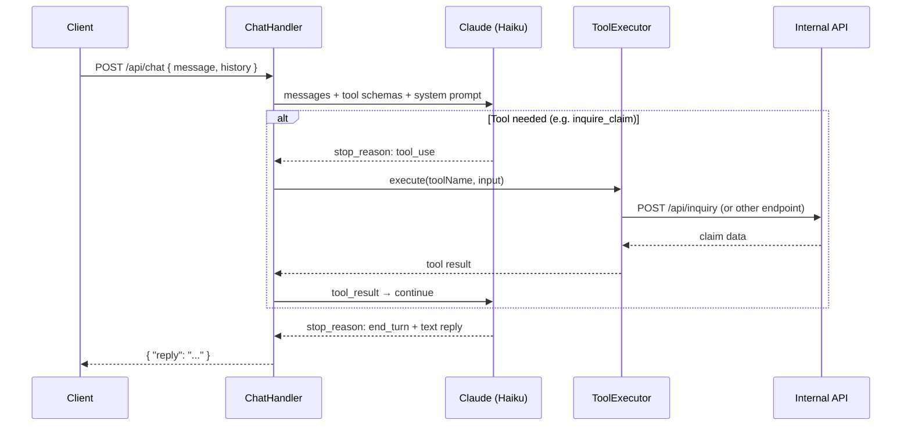

# Asset Claims API

Production-ready asset claims submission API built with **Kotlin**, **Vert.x**, **OpenAPI 3.0**, and **Couchbase**.

---

## Quick Start

> **See [QUICKSTART.md](./QUICKSTART.md) for the fastest path to a running stack.**
>
> TL;DR — if Docker Desktop is running and Couchbase is already initialised:
> ```bash
> docker compose up -d
> # wait ~20 seconds
> curl http://localhost:8080/health
> ```
> First time? Follow the one-time Couchbase init steps in [QUICKSTART.md](./QUICKSTART.md).

---

## Tech Stack

| Layer | Technology |
|---|---|
| Language | Kotlin 2.0 / JVM 21 |
| Framework | Vert.x 4.5 (non-blocking, event-loop) |
| API Contract | OpenAPI 3.0 (contract-first) |
| Database | Couchbase Community (Dockerized) |
| Async | Kotlin coroutines (`vertx-lang-kotlin-coroutines`) |
| Logging | Logback + Logstash JSON encoder |
| Build | Gradle Kotlin DSL + Shadow plugin (fat jar) |
| Container | Docker multi-stage build |

---

## Project Structure

```
asset-claims-system-api/
├── build.gradle.kts                  # Gradle Kotlin DSL build file
├── settings.gradle.kts
├── Dockerfile                        # Multi-stage Docker build
├── docker-compose.yml                # API + Couchbase services
├── .env.example                      # Environment variable reference
└── src/
    ├── main/
    │   ├── kotlin/com/example/claims/
    │   │   ├── Main.kt               # Application entry point
    │   │   ├── config/
    │   │   │   └── AppConfig.kt      # Environment-based configuration
    │   │   ├── verticle/
    │   │   │   └── MainVerticle.kt   # Vert.x verticle, routing, OpenAPI wiring
    │   │   ├── handler/
    │   │   │   └── ClaimHandler.kt   # HTTP request handler
    │   │   ├── repository/
    │   │   │   └── ClaimRepository.kt # Couchbase persistence
    │   │   └── validation/
    │   │       └── BankFieldsValidator.kt # Currency-specific bank field rules
    │   └── resources/
    │       ├── logback.xml           # JSON structured logging
    │       ├── openapi/
    │       │   └── claims-api.yaml   # OpenAPI 3.0 spec (single source of truth)
    │       └── swagger-ui/
    │           └── index.html        # Swagger UI served at /docs
    └── test/
        └── kotlin/com/example/claims/
            ├── handler/
            │   └── ClaimSubmitIntegrationTest.kt
            └── repository/
                └── BankFieldsValidatorTest.kt
```

---

## Installation (macOS)

```bash
brew install openjdk@21
brew install gradle
brew install --cask docker

# Verify
java -version   # should show 21.x
gradle -v
docker --version

# Set JAVA_HOME if needed
export JAVA_HOME=$(/usr/libexec/java_home -v 21)
```

---

## Running Locally (without Docker)

### 1. Start Couchbase

```bash
docker run -d \
  --name couchbase-local \
  -p 8091-8096:8091-8096 \
  -p 11210:11210 \
  couchbase:community-7.6.3
```

### 2. Initialize Couchbase Cluster

Open http://localhost:8091 in your browser and:

1. Click **Setup New Cluster**
2. Cluster name: `claims-cluster`
3. Username: `Administrator`
4. Password: `password`
5. Click **Next → Finish with Defaults**
6. Go to **Buckets → Add Bucket**
7. Bucket name: `claims`, RAM quota: `256 MB`
8. Click **Add Bucket**
9. Go to **Query → Query Editor** and create a primary index:
   ```sql
   CREATE PRIMARY INDEX ON `claims`;
   ```

### 3. Build and Run

```bash
# Build fat jar
./gradlew shadowJar

# Run with environment variables
export COUCHBASE_HOST=localhost
export COUCHBASE_USERNAME=Administrator
export COUCHBASE_PASSWORD=password
export COUCHBASE_BUCKET=claims

java -jar build/libs/claims-api.jar
```

The API starts at: http://localhost:8080

---

## Running with Docker Compose

```bash
# Build and start all services
docker-compose up --build

# In detached mode
docker-compose up --build -d

# View logs
docker-compose logs -f api

# Stop
docker-compose down
```

After startup:

1. **Initialize Couchbase** (one time only — see [QUICKSTART.md](./QUICKSTART.md) for the scripted init steps)
2. API available at: http://localhost:8080
3. Swagger UI: http://localhost:8080/docs
4. Health check: http://localhost:8080/health

---

## Couchbase Setup (Programmatic — Optional)

After the cluster is running you can use the REST API:

```bash
# Initialize cluster
curl -u Administrator:password \
  http://localhost:8091/clusterInit \
  -d "clusterName=claims-cluster" \
  -d "services=kv,n1ql,index" \
  -d "memoryQuota=512" \
  -d "username=Administrator" \
  -d "password=password" \
  -d "port=8091"

# Create bucket
curl -u Administrator:password \
  http://localhost:8091/pools/default/buckets \
  -d "name=claims" \
  -d "bucketType=couchbase" \
  -d "ramQuotaMB=256"

# Create primary index (wait for cluster to initialize first)
curl -u Administrator:password \
  http://localhost:8093/query/service \
  -d 'statement=CREATE+PRIMARY+INDEX+ON+`claims`'
```

---

## Environment Variables

| Variable | Default | Description |
|---|---|---|
| `SERVER_PORT` | `8080` | HTTP server port |
| `SERVER_HOST` | `0.0.0.0` | HTTP bind host |
| `MAX_BODY_SIZE` | `1048576` | Max request body in bytes (1 MB) |
| `CORS_ALLOWED_ORIGINS` | `*` | Comma-separated CORS origins |
| `COUCHBASE_HOST` | `localhost` | Couchbase host |
| `COUCHBASE_USERNAME` | `Administrator` | Couchbase username |
| `COUCHBASE_PASSWORD` | `password` | Couchbase password |
| `COUCHBASE_BUCKET` | `claims` | Couchbase bucket name |
| `ENV` | `local` | Environment label (used in logs) |

---

## API Endpoints

### Health Check

```
GET /health
```

Response:
```json
{ "status": "UP", "timestamp": "2026-03-01T10:30:00Z" }
```

### Submit Claim

```
POST /api/submit
Content-Type: application/json
```

### Chat Assistant

```
POST /api/chat
Content-Type: application/json
```

```json
{ "message": "What is the status of my claim?", "referenceNumber": "ACL-TC5MOF-7LC8", "lastName": "Smith" }
```

`referenceNumber` and `lastName` are optional — the assistant asks for them only when needed.

#### Chat Flow



### Swagger UI

```
GET /docs
```

---

## Example curl Request

```bash
curl -X POST http://localhost:8080/api/submit \
  -H "Content-Type: application/json" \
  -d '{
    "locale": "en",
    "submittedAt": "2026-03-01T10:30:00Z",
    "step1": {
      "confirmed": true
    },
    "step2": {
      "firstName": "Jane",
      "lastName": "Smith",
      "dateOfBirth": "1990-04-22",
      "nationality": "GB",
      "idType": "passport",
      "idNumber": "P9876543",
      "street1": "10 Downing Street",
      "city": "London",
      "postalCode": "SW1A 2AA",
      "country": "GB",
      "phone": "+441234567890",
      "email": "jane.smith@example.com"
    },
    "step3": {
      "assetType": "stock",
      "tickerSymbol": "TSLA",
      "exchange": "NASDAQ",
      "sharesOwned": "50"
    },
    "step4": {
      "currency": "GBP",
      "bankFields": {
        "sort_code": "40-30-20",
        "account_number": "12345678"
      }
    }
  }'
```

Expected success response:
```json
{
  "success": true,
  "referenceNumber": "ACL-M5X2K1-AB3C",
  "message": "Claim submitted successfully."
}
```

Expected 422 response:
```json
{
  "success": false,
  "message": "Validation failed. Please review your submission.",
  "errors": [
    {
      "field": "step2.email",
      "code": "invalid_string",
      "message": "Invalid email address."
    }
  ]
}
```

---

## Full JSON Payload Examples

### Stock Claim (USD)
```json
{
  "locale": "en",
  "submittedAt": "2026-03-01T10:30:00Z",
  "step1": { "confirmed": true },
  "step2": {
    "firstName": "John", "lastName": "Doe",
    "dateOfBirth": "1985-06-15", "nationality": "US",
    "idType": "passport", "idNumber": "A12345678",
    "street1": "123 Main St", "city": "New York",
    "postalCode": "10001", "country": "US",
    "phone": "+12125551234", "email": "john@example.com"
  },
  "step3": {
    "assetType": "stock",
    "tickerSymbol": "AAPL",
    "exchange": "NASDAQ",
    "sharesOwned": "100"
  },
  "step4": {
    "currency": "USD",
    "bankFields": {
      "account_number": "123456789",
      "routing_number": "021000021"
    }
  }
}
```

### Crypto Claim (EUR)
```json
{
  "locale": "de",
  "submittedAt": "2026-03-01T10:30:00Z",
  "step1": { "confirmed": true },
  "step2": { "...": "same as above" },
  "step3": {
    "assetType": "crypto",
    "cryptoExchange": "Coinbase",
    "cryptoAccountId": "user@example.com",
    "cryptoAssetSymbol": "BTC",
    "cryptoAmount": "0.5"
  },
  "step4": {
    "currency": "EUR",
    "bankFields": {
      "iban": "DE89370400440532013000",
      "bic": "COBADEFFXXX"
    }
  }
}
```

### Bond Claim (JPY)
```json
{
  "locale": "ja",
  "submittedAt": "2026-03-01T10:30:00Z",
  "step1": { "confirmed": true },
  "step2": { "...": "..." },
  "step3": {
    "assetType": "bond",
    "isin": "JP3633400001",
    "faceValue": "1000000",
    "maturityDate": "2030-12-31"
  },
  "step4": {
    "currency": "JPY",
    "bankFields": {
      "bank_code": "0001",
      "branch_code": "123",
      "account_number": "1234567"
    }
  }
}
```

---

## Discriminator Usage (step3)

`step3` uses an OpenAPI 3.0 **discriminator** with `oneOf` to select the correct asset schema based on `assetType`:

| `assetType` value | Schema | Required fields |
|---|---|---|
| `stock` | `StockAsset` | tickerSymbol, exchange, sharesOwned |
| `etf` | `EtfAsset` | tickerSymbol, exchange, sharesOwned |
| `bond` | `BondAsset` | isin, faceValue, maturityDate |
| `mutual_fund` | `MutualFundAsset` | fundName, fundCode, unitsHeld |
| `crypto` | `CryptoAsset` | cryptoExchange, cryptoAccountId, cryptoAssetSymbol, cryptoAmount |
| `savings` | `SavingsAsset` | bankName, savingsAccountNumber, savingsBalance |

Vert.x OpenAPI validates the discriminator automatically — unknown `assetType` values or missing required fields result in a `422` response.

---

## bankFields Validation

`step4.bankFields` is an open object (`additionalProperties: true`) in the OpenAPI spec because its required keys vary per currency. Server-side validation (`BankFieldsValidator.kt`) enforces the rules:

| Currency | Required fields | Format |
|---|---|---|
| USD | account_number, routing_number | 4-17 digits; exactly 9 digits |
| EUR | iban | valid IBAN; bic optional |
| GBP | sort_code, account_number | `DD-DD-DD`; 8 digits |
| JPY | bank_code, branch_code, account_number | 4 digits; 3 digits; 7 digits |
| AUD | bsb, account_number | 6 digits; 5-9 digits |
| CAD | institution_number, transit_number | 3 digits; 5 digits |
| CHF | iban | must start with `CH` |
| CNH | account_number, bank_name | 8-20 digits; non-empty |
| HKD | account_number, bank_code | 6-12 digits; 3 digits |
| NZD | account_number | `DD-DDDD-DDDDDDD-DD[D]` |

---

## Running Tests

```bash
# All tests
./gradlew test

# With output
./gradlew test --info

# Specific test class
./gradlew test --tests "com.example.claims.repository.BankFieldsValidatorTest"
```

---

## Future Extensions

1. **Authentication** — Add JWT validation via `vertx-auth-jwt` or OAuth2
2. **Rate Limiting** — Use `vertx-redis-client` with a sliding window counter per IP/token
3. **Couchbase Index** — Add secondary index on `referenceNumber` for efficient lookups:
   ```sql
   CREATE INDEX idx_reference_number ON `claims`(referenceNumber);
   ```
4. **Event streaming** — Publish submitted claims to Kafka/Pulsar for downstream processing
5. **PII Encryption** — Encrypt `step2` (personal data) at rest using AWS KMS or Vault
6. **Metrics** — Expose Prometheus metrics via `vertx-micrometer-metrics`
7. **Tracing** — Integrate OpenTelemetry for distributed tracing
8. **Multi-region** — Use Couchbase XDCR for cross-datacenter replication
9. **API versioning** — Add `/v2/` prefix and maintain backward compatibility
10. **Claim status polling** — Add `GET /api/claims/{referenceNumber}` endpoint
