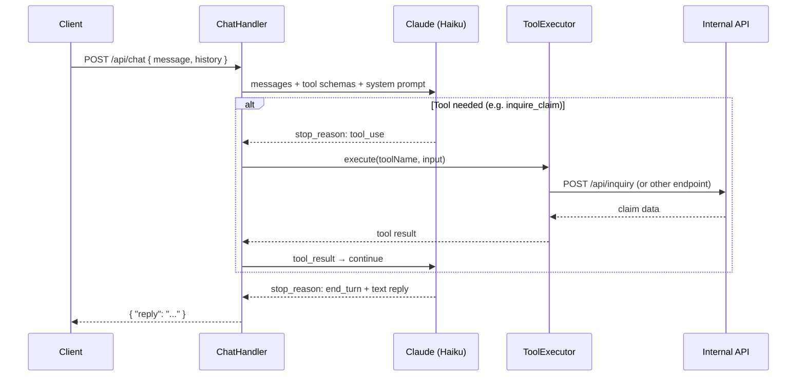

# Asset Claims API

Production-ready asset claims submission API built with **Kotlin**, **Vert.x**, **OpenAPI 3.0**, **Couchbase**, and **MinIO/S3**, with a built-in **Claude-powered chat assistant**.

---

## Quick Start

> **See [QUICKSTART.md](./QUICKSTART.md) for the fastest path to a running stack.**
>
> TL;DR — if Docker Desktop is running and Couchbase is already initialised:
> ```bash
> docker compose up -d
> # wait ~20 seconds
> curl http://localhost:8080/health
> ```
> First time? Follow the one-time Couchbase init steps in [QUICKSTART.md](./QUICKSTART.md).

---

## Features

- **Claim submission** — multi-step wizard (personal details → asset → bank payout) with OpenAPI contract validation
- **Claim inquiry** — look up claim status by reference number + identity verification
- **Document management** — upload/download/delete documents (PDF, DOCX, PNG, JPG) stored in MinIO/S3
- **Chat assistant** — Claude Haiku-powered conversational assistant with tool-calling (check claim status, list documents)
- **Multi-language validation** — 11 locales: en, fr, es, de, pt, zh, ar, hi, bn, ur, ru
- **Swagger UI** — interactive API docs served at `/docs`

---

## Quick Start

> **See [QUICKSTART.md](./QUICKSTART.md) for the fastest path to a running stack.**
>
> TL;DR — if Docker Desktop is running and Couchbase is already initialised:
> ```bash
> docker compose up -d
> # wait ~20 seconds
> curl http://localhost:8080/health
> ```
> First time? Follow the one-time Couchbase init steps in [QUICKSTART.md](./QUICKSTART.md).

---

## Tech Stack

| Layer | Technology |
|---|---|
| Language | Kotlin 2.0 / JVM 21 |
| Framework | Vert.x 4.5 (non-blocking, event-loop) |
| API Contract | OpenAPI 3.0 (contract-first, `vertx-web-openapi`) |
| Database | Couchbase Enterprise 7.6.3 |
| Object Storage | MinIO (S3-compatible) / AWS S3 |
| AI | Anthropic Claude Haiku (chat assistant) |
| Async | Kotlin coroutines (`vertx-lang-kotlin-coroutines`) |
| Logging | Logback + Logstash JSON encoder |
| Build | Gradle Kotlin DSL + Shadow plugin (fat jar) |
| Container | Docker multi-stage build |

---

## Project Structure

```
asset-claims-system-api/
├── build.gradle.kts
├── settings.gradle.kts
├── Dockerfile                          # Multi-stage Docker build
├── docker-compose.yml                  # API + Couchbase + MinIO services
├── QUICKSTART.md
└── src/
    ├── main/
    │   ├── kotlin/com/example/claims/
    │   │   ├── Main.kt                 # Entry point, graceful shutdown
    │   │   ├── config/
    │   │   │   └── AppConfig.kt        # Env-based configuration
    │   │   ├── verticle/
    │   │   │   └── MainVerticle.kt     # Router wiring, OpenAPI setup
    │   │   ├── handler/
    │   │   │   ├── ClaimHandler.kt     # POST /api/submit
    │   │   │   ├── ClaimInquiryHandler.kt  # POST /api/inquiry
    │   │   │   ├── ClaimsChatHandler.kt    # POST /api/chat
    │   │   │   └── DocumentHandler.kt      # /api/documents/*
    │   │   ├── client/
    │   │   │   ├── AnthropicClient.kt      # Anthropic API HTTP client
    │   │   │   └── ClaimsToolExecutor.kt   # Chat tool implementations
    │   │   ├── repository/
    │   │   │   ├── ClaimRepository.kt      # Couchbase claim persistence
    │   │   │   └── DocumentRepository.kt   # Couchbase document metadata
    │   │   ├── service/
    │   │   │   └── DocumentService.kt      # Upload orchestration
    │   │   ├── storage/
    │   │   │   ├── StorageService.kt       # Storage interface
    │   │   │   └── S3StorageService.kt     # MinIO/S3 implementation
    │   │   ├── model/
    │   │   │   └── DocumentMetadata.kt
    │   │   └── validation/
    │   │       ├── Messages.kt             # Locale-aware message loading
    │   │       ├── Step2Validator.kt       # Personal details validation
    │   │       ├── Step3Validator.kt       # Asset type discriminator
    │   │       ├── BankFieldsValidator.kt  # Currency-specific bank rules
    │   │       └── InquiryValidator.kt     # Inquiry request validation
    │   └── resources/
    │       ├── logback.xml
    │       ├── messages/                   # messages_{locale}.properties (11 locales)
    │       ├── openapi/
    │       │   └── claims-api.yaml         # OpenAPI 3.0 spec (single source of truth)
    │       └── swagger-ui/
    │           └── index.html              # Swagger UI served at /docs
    └── test/
        └── kotlin/com/example/claims/
            ├── handler/
            │   ├── ClaimSubmitIntegrationTest.kt
            │   ├── ClaimInquiryIntegrationTest.kt
            │   └── DocumentHandlerIntegrationTest.kt
            ├── service/
            │   └── DocumentServiceTest.kt
            ├── repository/
            │   └── BankFieldsValidatorTest.kt
            └── validation/
                ├── MessagesTest.kt
                ├── Step2ValidatorTest.kt
                └── Step3ValidatorTest.kt
```

---

## Installation (macOS)

```bash
brew install openjdk@21
brew install --cask docker

# Set JAVA_HOME if needed
export JAVA_HOME=$(/usr/libexec/java_home -v 21)
```

---

## Running with Docker Compose

```bash
# Build and start all services (API + Couchbase + MinIO)
docker compose up --build -d

# View logs
docker compose logs -f api

# Stop
docker compose down
```

After startup:

1. **Initialize Couchbase** — one time only, see [QUICKSTART.md](./QUICKSTART.md)
2. API: http://localhost:8080
3. Swagger UI: http://localhost:8080/docs
4. Health check: http://localhost:8080/health
5. MinIO console: http://localhost:9001 (minioadmin / minioadmin123)
6. Couchbase console: http://localhost:8091 (Administrator / password)

---

## Running Locally (without Docker)

### 1. Start dependencies

```bash
# Couchbase
docker run -d --name couchbase-local \
  -p 8091-8096:8091-8096 -p 11210:11210 \
  couchbase:enterprise-7.6.3

# MinIO
docker run -d --name minio-local \
  -p 9000:9000 -p 9001:9001 \
  -e MINIO_ROOT_USER=minioadmin \
  -e MINIO_ROOT_PASSWORD=minioadmin123 \
  minio/minio server /data --console-address ":9001"
```

### 2. Initialize Couchbase (one-time)

See [QUICKSTART.md](./QUICKSTART.md) for the scripted init steps.

### 3. Build and run

```bash
./gradlew shadowJar

export COUCHBASE_HOST=localhost
export COUCHBASE_USERNAME=Administrator
export COUCHBASE_PASSWORD=password
export COUCHBASE_BUCKET=claims
export S3_ENDPOINT=http://localhost:9000
export S3_ACCESS_KEY=minioadmin
export S3_SECRET_KEY=minioadmin123
export ANTHROPIC_API_KEY=sk-ant-...

java -jar build/libs/claims-api.jar
```

---

## Environment Variables

### Server

| Variable | Default | Description |
|---|---|---|
| `SERVER_PORT` | `8080` | HTTP server port |
| `SERVER_HOST` | `0.0.0.0` | HTTP bind host |
| `MAX_BODY_SIZE` | `1048576` | Max JSON request body (bytes) |
| `MAX_UPLOAD_SIZE` | `10485760` | Max file upload size (bytes) |
| `CORS_ALLOWED_ORIGINS` | `*` | Comma-separated allowed origins |

### Couchbase

| Variable | Default | Description |
|---|---|---|
| `COUCHBASE_HOST` | `localhost` | Couchbase host |
| `COUCHBASE_USERNAME` | `Administrator` | Couchbase username |
| `COUCHBASE_PASSWORD` | `password` | Couchbase password |
| `COUCHBASE_BUCKET` | `claims` | Couchbase bucket name |

### Object Storage (MinIO / S3)

| Variable | Default | Description |
|---|---|---|
| `S3_ENDPOINT` | `http://localhost:9000` | S3 endpoint URL (empty = real AWS S3) |
| `S3_ACCESS_KEY` | `minioadmin` | S3 access key |
| `S3_SECRET_KEY` | `minioadmin123` | S3 secret key |
| `S3_BUCKET` | `documents` | S3 bucket for uploaded files |
| `S3_REGION` | `us-east-1` | S3 region |

### Anthropic (Chat Assistant)

| Variable | Default | Description |
|---|---|---|
| `ANTHROPIC_API_KEY` | _(empty)_ | Anthropic API key — required for `/api/chat` |
| `CLAIMS_API_BASE_URL` | `http://localhost:8080` | Self-referencing URL used by tool executor |

---

## API Endpoints

### Health Check

```
GET /health
```

```json
{ "status": "UP", "db": "UP", "storage": "UP", "timestamp": "2026-04-30T10:00:00Z" }
```

`db` is `DEGRADED` if Couchbase is unreachable. The API starts and serves requests immediately; backends connect in the background.

---

### Submit Claim

```
POST /api/submit
Content-Type: application/json
```

Four-step payload validated by OpenAPI + server-side validators:

| Step | Content |
|---|---|
| `step1` | Confirmation flag (`confirmed: true`) |
| `step2` | Personal details (name, DOB, ID, address, contact) |
| `step3` | Asset details — discriminated by `assetType` |
| `step4` | Payout currency + bank fields |

**Success (200):**
```json
{ "success": true, "referenceNumber": "ACL-M5X2K1-AB3C", "message": "Claim submitted successfully." }
```

**Validation error (422):**
```json
{
  "success": false,
  "message": "Validation failed. Please review your submission.",
  "errors": [{ "field": "step2.email", "code": "invalid_string", "message": "Invalid email address." }]
}
```

Reference number format: `ACL-{base36(epochSeconds)}-{random4chars}`

---

### Claim Inquiry

```
POST /api/inquiry
Content-Type: application/json
```

```json
{
  "referenceNumber": "ACL-M5X2K1-AB3C",
  "lastName": "Smith",
  "dateOfBirth": "1990-04-22",
  "locale": "en"
}
```

`dateOfBirth` is optional. Returns claim status, asset type, submission date, and personal details summary.

---

### Document Upload

```
POST /api/documents/upload
Content-Type: multipart/form-data
```

| Field | Required | Description |
|---|---|---|
| `file` | Yes | File to upload (PDF, DOC, DOCX, PNG, JPG — max 10 MB) |
| `uploadedBy` | No | Uploader identifier (e.g. user ID or email) |
| `referenceNumber` | No | Claim reference for traceability |
| `documentType` | No | Label (e.g. `passport`, `bank_statement`) |

```bash
curl -X POST http://localhost:8080/api/documents/upload \
  -F "file=@passport.pdf" \
  -F "referenceNumber=ACL-M5X2K1-AB3C" \
  -F "documentType=passport"
```

**Success (200):**
```json
{ "id": "doc-abc123", "filename": "passport.pdf", "size": 204800, "uploadedAt": "2026-04-30T10:00:00Z" }
```

---

### List Documents (all)

```
GET /api/documents
```

Returns metadata for all uploaded documents.

---

### List Documents by Claim (identity-verified)

```
POST /api/documents/by-claim
Content-Type: application/json
```

```json
{ "referenceNumber": "ACL-M5X2K1-AB3C", "lastName": "Smith", "dateOfBirth": "1990-04-22" }
```

Identity is verified against the claim record before listing documents. Returns only documents tagged with the matching `referenceNumber`.

---

### Download Document

```
GET /api/documents/{documentId}/download
```

Returns the file binary with the original `Content-Type`.

---

### Delete Document

```
DELETE /api/documents/{documentId}
```

Deletes from both S3 storage and Couchbase metadata.

---


### Chat Assistant

```
POST /api/chat
Content-Type: application/json
```

```json
{
  "message": "What is the status of my claim?",
  "referenceNumber": "ACL-M5X2K1-AB3C",
  "lastName": "Smith",
  "history": []
}
```

`referenceNumber` and `lastName` are optional — the assistant asks for them only when needed. `history` is an array of prior `{ role, content }` turns for multi-turn conversations.

**Response:**
```json
{ "reply": "Your claim ACL-M5X2K1-AB3C is currently under review, submitted on 2026-04-15." }
```

The assistant uses **Claude Haiku** with tool-calling to fetch live data:

| Tool | Description |
|---|---|
| `inquire_claim` | Look up claim status via `POST /api/inquiry` |
| `list_claim_documents` | List documents for a claim via `POST /api/documents/by-claim` |
| `list_documents` | List all documents |
| `check_health` | Check API health |

#### Chat Flow



---


### Swagger UI

```
GET /docs
```

Interactive API explorer — auto-generated from `claims-api.yaml`.

---

## Claim Submission Details

### step3 — Asset Type Discriminator

`assetType` selects the schema variant. Unknown values or missing required fields return `422`.

| `assetType` | Required fields |
|---|---|
| `stock` | tickerSymbol, exchange, sharesOwned |
| `etf` | tickerSymbol, exchange, sharesOwned |
| `bond` | isin, faceValue, maturityDate |
| `mutual_fund` | fundName, fundCode, unitsHeld |
| `crypto` | cryptoExchange, cryptoAccountId, cryptoAssetSymbol, cryptoAmount |
| `savings` | bankName, savingsAccountNumber, savingsBalance |

### step4 — bankFields Validation

`bankFields` is an open object in the OpenAPI spec; `BankFieldsValidator.kt` enforces currency-specific rules server-side.

| Currency | Required fields | Format |
|---|---|---|
| USD | account_number, routing_number | 4-17 digits; exactly 9 digits |
| EUR | iban | valid IBAN; bic optional |
| GBP | sort_code, account_number | `DD-DD-DD`; 8 digits |
| JPY | bank_code, branch_code, account_number | 4 digits; 3 digits; 7 digits |
| AUD | bsb, account_number | 6 digits; 5-9 digits |
| CAD | institution_number, transit_number | 3 digits; 5 digits |
| CHF | iban | must start with `CH` |
| CNH | account_number, bank_name | 8-20 digits; non-empty |
| HKD | account_number, bank_code | 6-12 digits; 3 digits |
| NZD | account_number | `DD-DDDD-DDDDDDD-DD[D]` |

---

## Multi-Language Support

Validation error messages are locale-aware. Pass `"locale"` in the request body. Supported locales:

`en` · `fr` · `es` · `de` · `pt` · `zh` · `ar` · `hi` · `bn` · `ur` · `ru`

Message files live in `src/main/resources/messages/messages_{locale}.properties`.

---

## Example curl Requests

### Submit a stock claim (GBP)

```bash
curl -X POST http://localhost:8080/api/submit \
  -H "Content-Type: application/json" \
  -d '{
    "locale": "en",
    "submittedAt": "2026-04-30T10:00:00Z",
    "step1": { "confirmed": true },
    "step2": {
      "firstName": "Jane", "lastName": "Smith",
      "dateOfBirth": "1990-04-22", "nationality": "GB",
      "idType": "passport", "idNumber": "P9876543",
      "street1": "10 Downing Street", "city": "London",
      "postalCode": "SW1A 2AA", "country": "GB",
      "phone": "+441234567890", "email": "jane.smith@example.com"
    },
    "step3": { "assetType": "stock", "tickerSymbol": "TSLA", "exchange": "NASDAQ", "sharesOwned": "50" },
    "step4": { "currency": "GBP", "bankFields": { "sort_code": "40-30-20", "account_number": "12345678" } }
  }'
```

### Inquire about a claim

```bash
curl -X POST http://localhost:8080/api/inquiry \
  -H "Content-Type: application/json" \
  -d '{ "referenceNumber": "ACL-M5X2K1-AB3C", "lastName": "Smith", "locale": "en" }'
```

### Upload a document

```bash
curl -X POST http://localhost:8080/api/documents/upload \
  -F "file=@/path/to/passport.pdf" \
  -F "referenceNumber=ACL-M5X2K1-AB3C" \
  -F "documentType=passport"
```

### Chat with the assistant

```bash
curl -X POST http://localhost:8080/api/chat \
  -H "Content-Type: application/json" \
  -d '{ "message": "Check the status of my claim ACL-M5X2K1-AB3C", "lastName": "Smith" }'
```

---

## Running Tests

```bash
# All tests
./gradlew test

# With output
./gradlew test --info

# Specific class
./gradlew test --tests "com.example.claims.repository.BankFieldsValidatorTest"
```

---

## Future Extensions

1. **Authentication** — JWT validation via `vertx-auth-jwt` or OAuth2
2. **Rate Limiting** — sliding window counter per IP via `vertx-redis-client`
3. **Secondary Index** — efficient claim lookups:
   ```sql
   CREATE INDEX idx_reference_number ON `claims`(referenceNumber);
   ```
4. **Event Streaming** — publish submitted claims to Kafka/Pulsar for downstream processing
5. **PII Encryption** — encrypt `step2` personal data at rest using AWS KMS or Vault
6. **Metrics** — Prometheus metrics via `vertx-micrometer-metrics`
7. **Tracing** — OpenTelemetry distributed tracing
8. **Multi-region** — Couchbase XDCR for cross-datacenter replication
